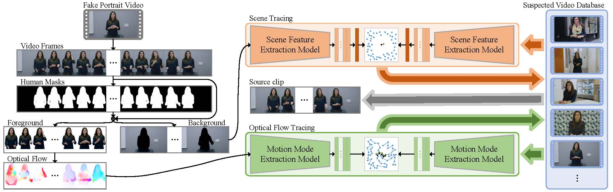

# FPVT

A Two-level Learning based Approach for Fake Portrait Videos Tracing

## Abstract



Fake Portrait Videos Tracing, which investigates the fake portrait videos and traces source videos from suspected video database at frame level, is a newly proposed challenging task for video forensics. Here, we propose the first solution exploiting two-level learning framework to trace fake portrait videos. Our approach mainly consists of two stages. First, the scene tracing stage aims to retrieve the most similar source video to the input fake portrait video from the suspected video database based on the scene features. Second, the optical flow tracing stage aims to locate the most similar source clip to the input fake portrait video from the retrieved source video based on the motion modes. After that, the source video of the input fake portrait video can be traced at frame level precisely.

## FakeDT Dataset

We released a fake portrait videos tracing dataset, named FakeTD, to support the development of more effective fake portrait videos tracing methods.

The FakeTD dataset can be downloaded from https://pan.baidu.com/s/1F4_sd7vXfd4lF8Esox7x6Q (Password: FPVT).

The structure of FakeDT dataset is:
```
FakeDT
|---FakeDT-1
|---|---fake
|---|---|---FakeTD-1+fake_part0.rar
|---|---|---FakeTD-1+fake_part1.rar
|---|---|---FakeTD-1+fake_part2.rar
|---|---source
|---|---|---FakeTD-1+source_part0.rar
|---FakeDT-2
|---|---fake
|---|---|---FakeTD-2+fake_part0.rar
|---|---source
|---|---|---FakeTD-2+source_part0.rar
```
For the source video of `scene_0000_video_0006.mp4` in `FakeTD-1+source_part0.rar`:
```
0000: index of scene
0006: number of source video with scene 0000
```
For the fake video of `scene_0000_fake_0008.mp4` in `FakeTD-1+fake_part0.rar`:
```
0000: index of scene
0008: number of fake video of scene 0000
```
For the source video of `source_02.mp4` in `FakeTD-2+source_part0.rar`:
```
02: index of source video
```
For the fake video of `source_02_fake_04.mp4` in `FakeTD-2+fake_part0.rar`:
```
02: index of source video
04: number of fake video of source video 02
```

## Demo Guide

### Environment

```
conda create -n trace_env python=3.7
pip install -r trace_env.txt
```

### Models

The models can be downloaded from https://pan.baidu.com/s/1y4poLsB0pvnBoSXZR86w8g (Password: FPVT).

### Testing process

Step 1: extract some frames from source video database

Command:
```
python step1_source_video2some_frames.py --video-root ./source_videos/
                                         --frame-root ./step1_source_frames/
                                         --extract-num 5
```
Output:
```
# step1: extract some frames from every source video
# step1: Successful: extracted 5 * 11 frames
```

Step 2: extract background form source frames

Command:
```
python step2_get_source_frames_back.py --frame-root ./step1_source_frames/
                                       --back-root ./step2_source_backs/
```
Output:
```
# step2: get back from every source frame
# step2: frame num: 55
# step2: Successful: get back over
```

Step 3: extract all frames, masks, backgrounds, foregrounds, rectangle of masks from fake video

Command:
```
python step3_get_fake_frames_back.py --video-path ./fake_video/source_01_fake_00.mp4
                                     --frame-root ./step3_fake_frames/
                                     --rect-root ./step3_fake_rect/
                                     --mask-root ./step3_fake_masks/
                                     --back-root ./step3_fake_backs/
                                     --fore-root ./step3_fake_fores/
```
Output:
```
# step3: extract all frames, background, masks, foreground and rect from input fake video.
# step3: from ./fake_video/source_01_fake_00.mp4
# step3: extract 839 frames over.
# step3: choose begin num of fake frame: 10
# step3: choose end num of fake frame: 35
# step3: extract 25 frames over.
# step3: frame num: 25.
# step3: extract background, masks and foreground over.
# step3: Successful: save rect pkl file over.
```

Step 4: get source video from source video database

Command:
```
python step4_source_video_map.py --fake_back_root ./step3_fake_backs/
                                 --source_back_root ./step2_source_backs/
                                 --source_video_root ./source_videos/
                                 --fake_video_path ./fake_video/source_01_fake_00.mp4
                                 --use_gpu_id "0"
                                 --image_size 256
                                 --model_path ./model/scene_model_32.pth
                                 --recompute_num 1
                                 --batch_size 64
                                 --num_workers 5
```
Output:
```
# step4: retrieval source video by scene feature map.
# step4: load model from /sdb1/lg/trace_data/test_github/model/scene_model_32.pth
# step4: choose frame num used for map scene: 5
# step4: loaded 275 = 64/5 pair image.
# step4: testing.
# step4: [19:55:20] [0/1] [0/5]
# step4: [19:55:20] [0/1] [1/5]
# step4: [19:55:20] [0/1] [2/5]
# step4: [19:55:21] [0/1] [3/5]
# step4: [19:55:21] [0/1] [4/5]
# step4: compare result and get order.
# step4: source video score num: 11
# step4: show top score num: 10
# step4: fake video name: source_01_fake_00.mp4
# step4: video name: scene_0005_video_0002.mp4, video score: 0.07670640
# step4: video name: scene_0007_video_0002.mp4, video score: 0.68218774
# step4: video name: scene_0006_video_0002.mp4, video score: 0.69714173
# step4: video name: scene_0009_video_0002.mp4, video score: 0.72676935
# step4: video name: scene_0010_video_0002.mp4, video score: 0.78590687
# step4: video name: scene_0001_video_0002.mp4, video score: 0.85758208
# step4: video name: scene_0002_video_0002.mp4, video score: 0.91325798
# step4: video name: scene_0008_video_0002.mp4, video score: 0.95695024
# step4: video name: scene_0003_video_0002.mp4, video score: 1.03249906
# step4: video name: scene_0011_video_0002.mp4, video score: 1.15526720
# step4: Successful: get source video.
```

Step 5: extract all frames, masks, backgrounds, foregrounds, rectangle of masks from traced source video

Command:
```
python step5_get_result_frames_back.py --source_video_path ./source_data/scene_0005_video_0002.mp4
                                       --source_frame_root ./step5_source_frames/
                                       --source_rect_root ./step5_source_rect/
                                       --source_mask_root ./step5_source_masks/
                                       --source_back_root ./step5_source_backs/
                                       --source_fore_root ./step5_source_fores/
```
Output:
```
# step5: extract some frames, background, masks, foreground and rect.
# step5: from /sdb1/lg/trace_data/test_github/source_data/scene_0005_video_0002.mp4
# step5: total frame number: 839
# step5: choose begin num of fake frame: 0
# step5: choose end num of fake frame: 50
# step5: extract 839 frames over
# step5: frame num: 50
# step5: extract background, masks and foreground over.
# step5: Successful: get one rect pkl file over.
```

Step 6: extract optical flow from fake video and source video

Command:
```
python step6_get_flow.py --fake_frame_root ./step3_fake_frames/
                         --fake_mask_root ./step3_fake_masks/
                         --fake_flow_root ./step6_fake_flows/
                         --source_frame_root ./step5_source_frames/
                         --source_mask_root ./step5_source_masks/
                         --source_flow_root ./step6_source_flows/
                         --model_path ./model/raft-sintel.pth
                         --use_gpu_id "0"
```
Output:
```
# step6: get all flow from fake frames and scence frames
# step6: fake frame pair is: 24
# step6: scence frame pair is: 49
# step6: load model from /sdb1/lg/trace_data/test_github/model/raft-sintel.pth
# step6: get fake frame flow
# step6: get scence frame flow
# step6: Successful: get flow over
```

Step 7: get source clip from traced source video

Command:
```
python step7_flow_map.py --fake_rect_pkl ./step3_fake_rect/source_01_fake_00.pkl
                         --fake_flow_root ./step6_fake_flows/
                         --source_rect_pkl ./step5_source_rect/scene_0005_video_0002.pkl
                         --source_flow_root ./step6_source_flows/
                         --model_path ./model/flow_model_77.pth
                         --use_gpu_id "0"
                         --image_size 256
                         --batch_size 64
                         --num_workers 5
```
Output:
```
# step7: get source video flow index by flow map
# step7: fake flow number: 24
# step7: choose sample num of map flow: 5
# step7: source flow number: 49
# step7: load model from /sdb1/lg/trace_data/test_github/model/flow_model_77.pth
# step7: testing
# step7: loaded 26 = 64/1 pair image
# step7: [20:26:49] [0/5] [0/1]
# step7: loaded 26 = 64/1 pair image
# step7: [20:26:51] [1/5] [0/1]
# step7: loaded 26 = 64/1 pair image
# step7: [20:26:54] [2/5] [0/1]
# step7: loaded 26 = 64/1 pair image
# step7: [20:26:56] [3/5] [0/1]
# step7: loaded 26 = 64/1 pair image
# step7: [20:26:58] [4/5] [0/1]
# step7: flow score num: 26
# step7: show top score num: 10
# step7: flow index: [10, 34], frame index: [10, 35], score: 0.02180487
# step7: flow index: [11, 35], frame index: [11, 36], score: 0.05250693
# step7: flow index: [12, 36], frame index: [12, 37], score: 0.05268258
# step7: flow index: [13, 37], frame index: [13, 38], score: 0.05558845
# step7: flow index: [19, 43], frame index: [19, 44], score: 0.05765110
# step7: flow index: [7, 31], frame index: [7, 32], score: 0.05907261
# step7: flow index: [8, 32], frame index: [8, 33], score: 0.06436583
# step7: flow index: [9, 33], frame index: [9, 34], score: 0.06472408
# step7: flow index: [18, 42], frame index: [18, 43], score: 0.06523571
# step7: flow index: [16, 40], frame index: [16, 41], score: 0.06900581
# step7: Successful: get location
```

## Acknowledgements

If you use the FPVT dataset or this repository, please cite the following paper:
```
@inproceedings{XXX,
  title = {A Two-level Learning based Approach for Fake Portrait Videos Tracing},
  author = {Gen Li, Xianfeng Zhao, Yun Cao},
  booktitle = {XXX},
  year = {2021}
}
```
or cite the online document:
```
@online{XXX,
  title = {A Two-level Learning based Approach for Fake Portrait Videos Tracing},
  author = {Gen Li, Xianfeng Zhao, Yun Cao},
  url = {https://github.com/iiecasligen/FPVT/},
  year = {2021}
}
```
